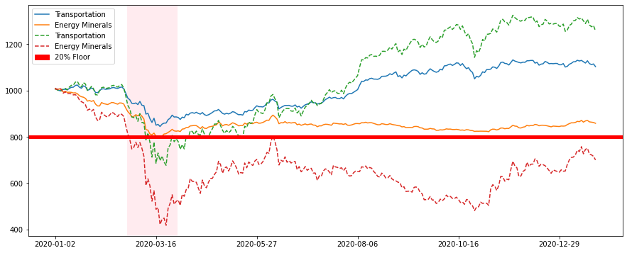
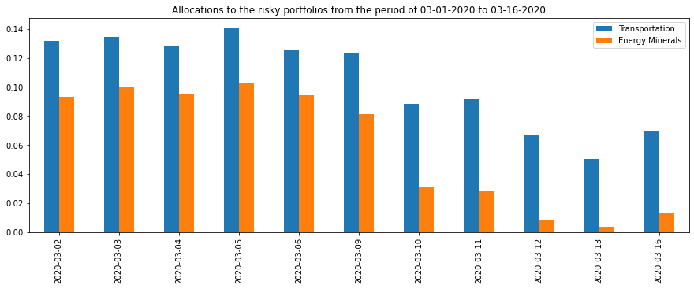
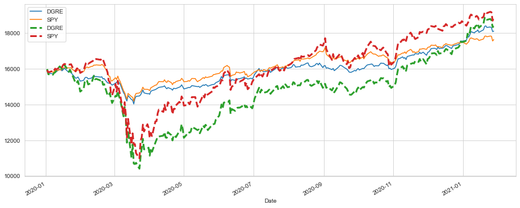

# cppi
Constant Proportion Portfolio Insurance
# Summary
I am calculating industry indixes from S&P500 stocks, modeling CPPI and comparing with industry returns
# Results
CPPI allows to calculate allocations to risky and "safe" assets based on the risk appetite and industry performance and change these allocations dynamically.


<br>


# Performance Comparison
Dynamic reallocation to STIP ETF reduced max drawdown by 17% and 38% for Transportation and Energy Minerals respectfully
### Bond + Equity combination
| Industry | Annualized Return | Annualized Vol | Sharpe Ratio | Max Drawdown |
|--------------|---|---|---|---|
|Transportation| 0.004125  |  0.029184 | -0.862939	  |  -0.17508 |
|Energy Minerals| -0.007116	  | 0.022741	  | -1.588453	  |-0.21078   |

### Pure Equity portfolio
| Industry | Annualized Return | Annualized Vol | Sharpe Ratio | Max Drawdown |
|--------------|---|---|---|---|
|Transportation| 0.009863	  |  0.079046 | -0.248029	  |  -0.348676 |
|Energy Minerals| -0.016292	  | 0.126969	  | -0.354979	  |-0.586560   |

# Quick Example
I used "robin_stocks" library to pull the prices for each stock in S&P500, their corresponsing sectors and capitalization. I found robin_stocks to be the most stable and reliable tool for pulling data for a large list of securities. <br>
In this example I want to give a quick example of how to perform CPPI algorithm only using free publickly available libraries such as "yfinance" and "yahoo_fin"

## Dependencies
```python
import pandas as pd
from datetime import date
import yahoo_fin.stock_info as si
import matplotlib.pyplot as plt
%matplotlib inline
import yfinance as yf
```
## Getting prices
As our risky assets we'll use SPDR S&P 500 ETF (SPY), which tracks performance of S&P500. We'll compare it to WisdomTree EM Quality Dividend Growth Fund (DGRE) to get a sence of exposure to Emerging Markets.<br>
We'll use Vanguard Short-Term TIPS ETF as our "safe" asset. We will increase allocation to TIPS as long as SPY and DGRE are dropping.
```python
hqualem_eq = yf.Ticker('DGRE').history(period='max') #WisdomTree EM Quality Dividend Growth Fund
hqualem_eq = hqualem_eq.add_suffix('_DGRE')

sp2 = yf.Ticker('SPY').history(period='max') #S&P500
sp2 = sp2.add_suffix('_SPY')

risky_price = pd.merge(hqualem_eq, sp2, left_index=True, right_index=True)
risky_price = risky_price.filter(like='Close')
ii = ['DGRE', 'SPY']
risky_price = risky_price.rename(columns={f'Close_{i}': i for i in ii})
risky = risky_price[['DGRE', 'SPY']].pct_change().dropna()


tips = yf.Ticker('VTIP').history(period='max') #Vanguard Short-Term TIPS ETF
tips = tips.add_suffix('_VTIP')

safe_price = tips.filter(like='Close')
safe_price = safe_price.rename(columns={'Close_VTIP': 'VTIP'})
safe = safe_price['VTIP'].pct_change().dropna()
```
## CPPI model

V<sub>risky = m*(V - F)<br>
  


where V<sub>risky

is the value of assets in the risky portfolio <br>
  V is the starting value of the total portfolio<br> 
  F is the asset level below which the total portfolio should not fall<br> m >= 1 is the multiplier (how risky you wanna be)

```python
def run_cppi(risky_r, safe_r=None, m=3, start=1000, floor=0.8, riskfree_rate=0.03, drawdown=None):
    """
    Run a backtest of the CPPI strategy, given a set of returns for the risky asset
    Returns a dictionary containing: Asset Value History, Risk Budget History, Risky Weight History
    """
    # set up the CPPI parameters
    dates = risky_r.index
    n_steps = len(dates)
    account_value = start
    floor_value = start*floor
    peak = account_value
    if isinstance(risky_r, pd.Series): 
        risky_r = pd.DataFrame(risky_r, columns=["R"])

    if safe_r is None:
        safe_r = pd.DataFrame().reindex_like(risky_r)
        safe_r.values[:] = riskfree_rate/350 # fast way to set all values to a number
    #else:
        #o = safe_r
        #safe_r = pd.DataFrame().reindex_like(risky_r)
        #safe_r.loc[:,:] = o.values[:,None]
    
    # set up some DataFrames for saving intermediate values
    account_history = pd.DataFrame().reindex_like(risky_r)
    risky_w_history = pd.DataFrame().reindex_like(risky_r)
    cushion_history = pd.DataFrame().reindex_like(risky_r)
    floorval_history = pd.DataFrame().reindex_like(risky_r)
    peak_history = pd.DataFrame().reindex_like(risky_r)

    for step in range(n_steps):
        if drawdown is not None:
            peak = np.maximum(peak, account_value)
            floor_value = peak*(1-drawdown)
        cushion = (account_value - floor_value)/account_value
        risky_w = m*cushion
        risky_w = np.minimum(risky_w, 1)
        risky_w = np.maximum(risky_w, 0)
        safe_w = 1-risky_w
        risky_alloc = account_value*risky_w
        safe_alloc = account_value*safe_w
        # recompute the new account value at the end of this step
        account_value = risky_alloc*(1+risky_r.iloc[step]) + safe_alloc*(1+safe_r.iloc[step])
       
        # save the histories for analysis and plotting
        cushion_history.iloc[step] = cushion
        risky_w_history.iloc[step] = risky_w
        account_history.iloc[step] = account_value
        floorval_history.iloc[step] = floor_value
        peak_history.iloc[step] = peak
    risky_wealth = start*(1+risky_r).cumprod()
    backtest_result = {
        "Wealth": account_history,
        "Risky Wealth": risky_wealth, 
        "Risk Budget": cushion_history,
        "Risky Allocation": risky_w_history,
        "m": m,
        "start": start,
        "floor": floor,
        "risky_r":risky_r,
        "safe_r": safe_r,
        "drawdown": drawdown,
        "peak": peak_history,
        "floor": floorval_history
    }
    return backtest_result, safe_r
```
## Running the model
I'll pick high multiplier to be highly exposed to the risky asset but will limit my drawdown to 10% 
```python
btr = run_cppi(risky['2020':], safe['2020':], m=6, start=15763, floor=0.8, drawdown=0.1)
ax = btr[0]["Wealth"].plot(figsize=(15,6))
btr[0]["Risky Wealth"].plot(ax=ax, style="--", linewidth=3)
```

